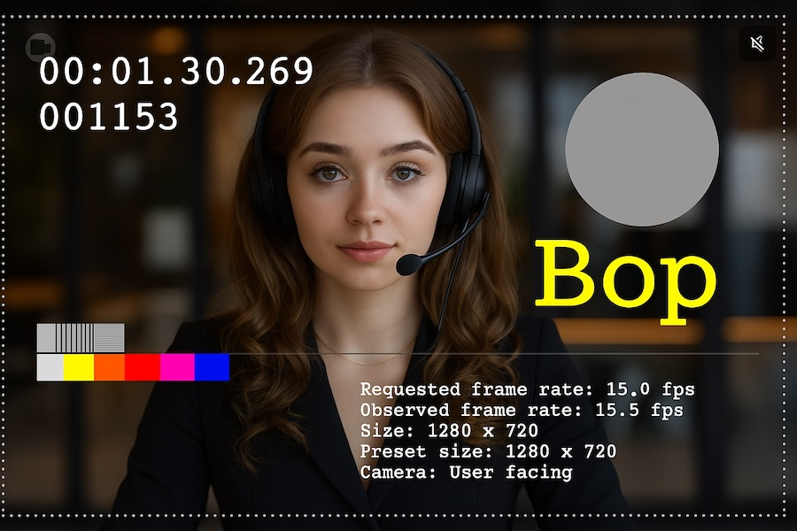

# Webcam Streaming WebRTC

React JS application for real-time WebRTC webcam video streaming: Broadcast camera live to multiple viewers. Public source code & build included.

[Live Demo](https://demo.videowhisper.com/Webcam-Streaming-WebRTC/)



## Features

- **Real-time WebRTC video streaming** with peer-to-peer connections
- **Broadcast Mode**: Publish live video from your camera to multiple viewers
- **Play Mode**: Watch live streams from broadcaster
- **Integrated Chat**: Real-time text chat within broadcast and play views.
- **Camera Selection**: Switch/rotate between available camera devices (mobile friendly)
- **Audio Controls**: Mute/unmute microphone in broadcast mode or audio in playback mode
- **Streaming Status Indicators**: Monitor streaming state and viewer count
- **Stream URL Sharing**: Easily share links to your channel
- **Multiple Authentication Options**: Support for both token-based and account/user/pin authentication
- **Autoplay**: Gracefully handles autoplay restrictions in modern browsers with Tap to Unmute / Play
- **Error Handling**: Displays error messages for issues
- **Responsive UI**: Built with Tailwind CSS

## Testing the Demo

You can test the application without installation by visiting the official demo:

### Demo Site
Visit [https://demo.videowhisper.com/Webcam-Streaming-WebRTC/](https://demo.videowhisper.com/Webcam-Streaming-WebRTC/) to try out the application.


### Testing as a Broadcaster
1. Access the demo link above
2. Allow camera and microphone permissions when prompted
3. The app should start broadcasting automatically
4. Test camera switching if you have multiple cameras
5. Click the TV button in the bottom right to open playback in a new tab
5. Use the URL copy buttons in the bottom right to share your stream
6. Note the viewer count on the connection button once connected (green)

### Testing as a Viewer
1. From a broadcaster session, open the URL in a new tab 
2. Optionally copy the URL and open in another browser or device or share with a friend
3. Playback should start automatically 
4. Test muting/unmuting the audio

## Installation Instructions

To install and run the application on your own server:

### Deploy Pre-built Distribution (Demo)

1. Download or build the distribution files (the `dist` folder)
2. Upload the files from `dist` to a folder on your web server (Apache, Nginx, etc.)
3. Fuplicate `unconfigured.json` in the root folder and update it with your streaming server details:

```json
{
    "channel": "YourChannelName",
    "username": "{generate}",
    "view": "BroadcastChat",
    "enableGET": true,
    "showURL": true,
    "videowhisperServer": {
        "socket": "wss://your-webrtc-server:3000",  
        "authentication": "token",
        "token": "your-account-token-here"
      },
    "stream": {
        "width": 640,
        "height": 360,
        "framerate": 15,
        "videoBitrate": 500,
        "audioBitrate": 32
    },
    "development": false
}
```
4. Replace `wss://your-webrtc-server:3000` and `your-token-here` with your VideoWhisper Server details (get a free account if you don't have own streaming server or account - see Requirements below)
5. Access the application through your web server

*Warning*: This is a demo setup for development and testing purposes with publicly accessible configuration file. For production, you should implement more advanced integration where streaming settings are provided only to authenticated users and further restrictions are implemented on server side.

### Requirements

- A web server with HTTPS (required for WebRTC in production)
- Access to a VideoWhisper Server that handles signaling, STUN/TURN (self-hosted [VideoWhisper Server](https://github.com/videowhisper/videowhisper-webrtc) or a *free* plan from [WebRTCHost](https://webrtchost.com/hosting-plans/#Streaming-Only) )
- Modern browser with WebRTC support (Chrome, Firefox, Safari, Edge, Brave)

### Quick Demo Links

When `enableGET: true` is set in the config, you can use URL parameters to quickly access broadcast/playback for specific channels:

- Broadcasting: `/?view=Broadcast&channel=MyChannel`
- Viewing: `/?view=Play&channel=MyChannel`


## Technical Implementation

This project implements WebRTC-based video streaming using a client-server architecture with peer-to-peer connections:

### VideoWhisper WebRTC Server

The application connects to the [VideoWhisper WebRTC Server](https://github.com/videowhisper/videowhisper-webrtc) which acts as a signaling server to:
- Establish connections between peers
- Manage channel/room subscriptions
- Handle WebRTC session negotiation
- Provide ICE server configuration for NAT traversal (STUN/TURN configuration)
- Handle access and limitations for streaming


### Key Views
The application supports multiple views that can be set in the configuration file or through URL `view` parameter:
- `BroadcastChat`: Camera controls, room chat, share buttons (default)
- `PlayChat`: Player with room chat
- `Broadcast`: Simple broadcaster view with camera selection and broadcasting controls, no room & chat
- `Play`: Simple player view, no room & chat
- `Chat`: Text chat-only room view
- `Debugger`: Only available in development mode, when a troubleshooting button is also available to switch at runtime

### Key Components

#### BroadcastWebRTC & Broadcast 

The broadcaster component captures local media and establishes peer connections with viewers:

- **Media Capture**: Accesses the user's camera and microphone 
- **Multiple Connections**: Maintains separate WebRTC peer connections for each viewer
- **Connection Management**:
  - Creates and sends offers to new viewers
  - Processes ICE candidates
  - Monitors connection states
  - Tracks connected peer count
- **Camera Controls**: Provides UI to switch between available camera devices

#### PlayWebRTC & Play

The player component receives and displays the live stream:

- **Session Management**: Subscribes to channels using the signaling server
- **WebRTC Handling**:
  - Processes incoming offers from broadcasters
  - Generates and sends answers
  - Sets up media reception
  - Monitors connection quality
- **Stream Statistics**: Collects and displays info about video resolution, bitrate, and FPS
- **Auto-reconnection**: Attempts to reconnect when connections fail

#### Chat Components

- **`ChatInterface`**: Main container for the chat UI, handling message sending and receiving.
- **`ChatDisplay`**: Displays incoming chat messages with auto-scroll and fade effects.
- **`ChatInput`**: Provides the text input field and send button.
- **`ChatToggle`**: Button to show/hide the chat interface.

### Key Hooks
- **broadcastWebRTC**: Custom hook for managing the broadcaster's WebRTC connections, including media capture and signaling.
- **playWebRTC**: Custom hook for managing the player's WebRTC connections, including session management and media reception.

### WebRTC Signaling Flow

1. The server connection is established using Socket.IO, either by using token or account/user/pin authentication. Room support requires account/user/pin authentication.

2. **Broadcaster flow**:
   - Broadcaster publishes to a channel (directly or in a room after joining)
   - WebRTC peer connections is created and offer is sent for each channel viewer
   - Media tracks are added to each peer connection
   - ICE candidates are exchanged via the signaling server

3. **Player flow**:
   - Viewer joins a room or subscribes to a channel (when not using rooms)
   - Receives offer from the broadcaster
   - Generates an answer and sends it back
   - ICE candidates are exchanged via the signaling server
   - Processes incoming media tracks and renders the video

## Configuration and Setup

### Demo: Using a configuration file (recommended for development)

To keep your development configuration private and separate from the public repository:

1. Copy `public/unconfigured.json` to `public/config.json`:
2. Register for a free developer account at [WebRTCHost](https://webrtchost.com/hosting-plans/#WebRTC-Only) or setup your self-hosted [VideoWhisper Server](https://github.com/videowhisper/videowhisper-webrtc)
3. Edit `public/config.json` and fill your development server details, set `deny` to `false` to allow access
  This file is automatically added to `.gitignore` to prevent it from being published

The application will:
- First try to load `config.json` (your private config)
- Fall back to `unconfigured.json` if not found

Copy `unconfigured.json` to `config.json` file in the public folder with settings like:

```
{
    "channel": "{generate}",      // Will auto-generate a channel name
    "username": "{generate}",     // Will auto-generate a username
    "view": "BroadcastChat",          // Initial view mode, see Views section below
    "enableGET": true,            // Allow URL parameters to override config
    "showURL": true,              // Show URL sharing button
    
    // Server configuration and authentication
    "videowhisperServer": {
        "socket": "wss://your-webrtc-server:3000",  // Your WebRTC server address
        
        // Authentication Option 1: Token-based authentication
        "authentication": "token",
        "token": "your-account-token-here",
        
        // Authentication Option 2: Account/User/Pin authentication
        // "authentication": "pin",
        // "account": "your-account-name",
        // "pin": "user-pin",
        // "user": "username" // Optional, defaults to the "username" value above
    },
    
    "stream": {
        "width": 640,
        "height": 360,
        "framerate": 15,
        "videoBitrate": 500,
        "audioBitrate": 32
    },
    "development": false  // Set to true for development mode and troubleshooting/logging
}
```


### Real Use: Custom configuration or integration

You can embed the application in your website and provide custom configuration through the `window.videowhisperConfig` object:

```html
<script>
window.videowhisperConfig = {
  configURL: "app-login.php" 
} 
</script>
```

You can use an integration script that provides streaming server details only to authenticated site users.
Further restrictions can be implemented on server side to limit access to streaming.

## Building and Development

### Prerequisites

- Node.js 18.x or higher
- npm or pnpm package manager

### Development Setup

1. Clone the repository:
   ```bash
   git clone https://github.com/videowhisper/Webcam-Streaming-WebRTC.git
   cd Webcam-Streaming-WebRTC
   ```

2. Install dependencies:
   ```bash
   npm install
   # or using pnpm
   pnpm install
   ```

3. Create a development configuration:
   - Copy `public/unconfigured.json` to `public/config.json`
   - Edit `public/config.json` with your WebRTC server details
   - Remove the `deny` property to enable access

4. Start the development server:
   ```bash
   npm run dev
   # or using pnpm
   pnpm dev
   ```

5. Access the application at `http://localhost:5173`

### Building for Production

1. Make sure your `vite.config.js` is set up correctly (the `config.json` will be excluded from the build)

2. Run the build command:
   ```bash
   npm run build
   # or using pnpm
   pnpm build
   ```

3. The build will be created in the `dist` directory

4. Deploy the contents of the `dist` directory to your web server
   - Note: You'll need to create a `config.json` file on your server as described in the installation instructions

When deploying, remember that the application requires a WebRTC signaling server to function properly.

## Development Best Practices

When developing or contributing to this project:

1. **Private Configuration**: Always use `config.json` for development and testing, not the public `unconfigured.json`
   - This file should contain your streaming server/account details and should not be shared publicly
   - The `unconfigured.json` file is a public template with out of the box values
2. **Environment Variables**: Consider using environment variables for sensitive data in production builds
3. **Configuration Template**: Update `unconfigured.json` if you add new configuration options
4. **Never Commit Credentials**: Ensure your private WebRTC server details are never committed to the repository

To prepare for publishing:
1. Ensure your private configuration (`config.json`) is added to `.gitignore`
2. Update `unconfigured.json` with placeholder values and the `deny` property
3. Update documentation as needed with any new configuration options

## Server Signaling

### Room Participant to Server
| Event | Parameters | Description |
|-------|-----------|-------------|
|`roomJoin` | `{room}` |  Joins a specific room/channel |
|`roomLeave` | `{room}` |  Leaves a specific room/channel |
|`message` | `{from, target, type, content, ...}` | Sends a message to a specific target (peer or room) |

Rooms require account/user/pin authentication to join. Joining room also handles channel subscriptions for players.

### Broadcaster to Server

| Event | Parameters | Description |
|-------|-----------|-------------|
| `publish` | `(username, channel, params)` | Starts broadcasting to the specified channel |
| `messagePeer` | `{from, target, type, content, ...}` | Sends WebRTC signaling data to viewers |
| `roomPublish` | `{room, channel, parameters}` |  Publishes a channel in room |
| `roomUnpublish` | `{room, channel}` |  Stops publishing a room channel |

### Player (Viewer) to Server

| Event | Parameters | Description |
|-------|-----------|-------------|
| `subscribe` | `(username, channel)` | Subscribes to a broadcast channel |
| `messagePeer` | `{from, target, type, content, ...}` | Sends WebRTC signaling data to broadcaster |

### Server to Client

| Event | Description |
|-------|-------------|
| `message` | General WebRTC signaling data (offers, answers, candidates) |
| `peers` | List of connected WebRTC peers and ICE server configuration, for Broadcaster |
| `peer` | Notification when a new WebRTC peer joins, for Broadcaster |
| `publishError` | Error notification for broadcasting issues, for Broadcaster |
| `subscribeError` | Error notification for playback issues, for Viewer  |
| `roomUpdate` | Room updates that may include |

### WebRTC Message Types between Peers (messagePeer)

| Type | Purpose |
|------|---------|
| `offer` | Initial connection offer from broadcaster to viewer, includes and ICE config |
| `answer` | Viewer's response to an offer |
| `candidate` | ICE candidate for connection establishment |

### roomUpdate elements
Room updates are sent to participants in the room and may include the following elements:
| Element | Description |
|---------|-------------|
| `error` | Error message, in example for trying to use room without previously joining |
| `messages` | List of messages |
| `messageNew` | New message in room |

### 2 Authentication Methods

The application supports two methods for authenticating with the VideoWhisper WebRTC Server:

#### 1. Token-Based Authentication (Development/Internal Use)

```json
"videowhisperServer": {
    "socket": "wss://VideoWhisper-Server:3000",
    "authentication": "token",
    "token": "your-account-token-here"
}
```

This method connects to the server using a token that validates against a static token or an account token in the server's database. 
Because the token is disclosed to client browser, it is recommended to use this method only for development or internal use.

#### 2. Account/User/Pin Authentication (Production Use)

```json
"videowhisperServer": {
    "socket": "wss://VideoWhisper-Server:3000",
    "authentication": "pin",
    "account": "account-name",
    "user": "user-name",
    "pin": "user-pin"
}
```
`videowhisperServer.user` defaults to `username` value in the config.

This method authenticates using an account name, username, and PIN. The server needs to have the account configured with a `loginURL` property. The server will validate the credentials by making a POST request to this URL. 
As authentication Pin is per client, this is the recommended method for public production use.

A sample `loginURL` endpoint is provided in `public/login.json` for reference/testing:
```json
 {
   "login": true, 
   "message": "Login accepted for user"
   }
```

The server will make a POST request to this URL with these parameters (that an integration script can use to authenticate user and return login true/false):
```json
{
   "account": "account-name", 
   "token": "account-token", 
   "user": "username", 
   "pin": "user-pin"
}
```

When implementing channel names take into consideration that server supports a `restrictPublish` setting per account for quck publishing authorization:
- `no` - no restrictions
- `username` - channel name should match the username
- `prefix` - channel name should start with the username
This is a quick way to prevent hijacking of channels by other users. Prefix can be used when you want to implement random channel names.

Benefits of using account/user/pin authentication:
- No need to store sensitive account tokens in client-side configurations
- Better user-specific access control
- Ability to implement custom authentication logic through the loginURL endpoint

## Styling and UI
Project uses [Tailwind CSS](https://tailwindcss.com/) for styling and [Vite](https://vite.dev). The UI is responsive and designed to work well on various screen sizes. For documentation on how to customize the styles, refer to the [Tailwind CSS + Vite documentation](https://tailwindcss.com/docs/installation/using-vite).

## Technologies Used
- **React**: JavaScript library for building user interfaces
- **Vite**: Build tool for fast development and production builds
- **Tailwind CSS**: Utility-first CSS framework for styling
- **Socket.IO**: Library for real-time communication between client and server
- **WebRTC**: Technology for real-time peer-to-peer communication
- **Zustand**: State management library for React
- **VideoWhisper Server**: Signaling server for WebRTC connections
